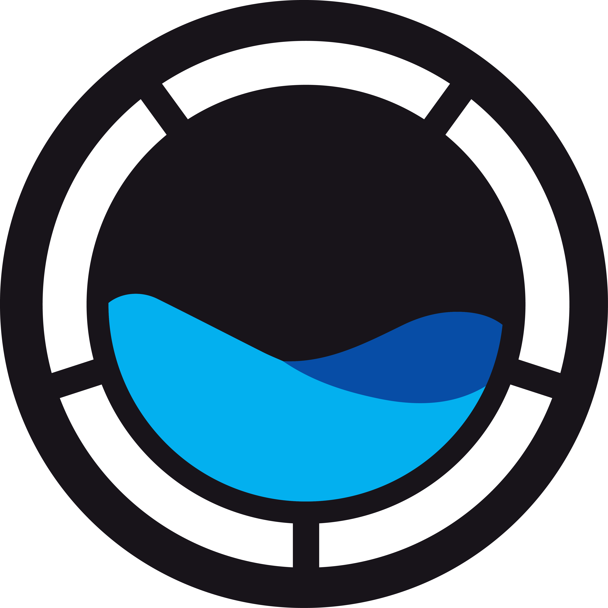
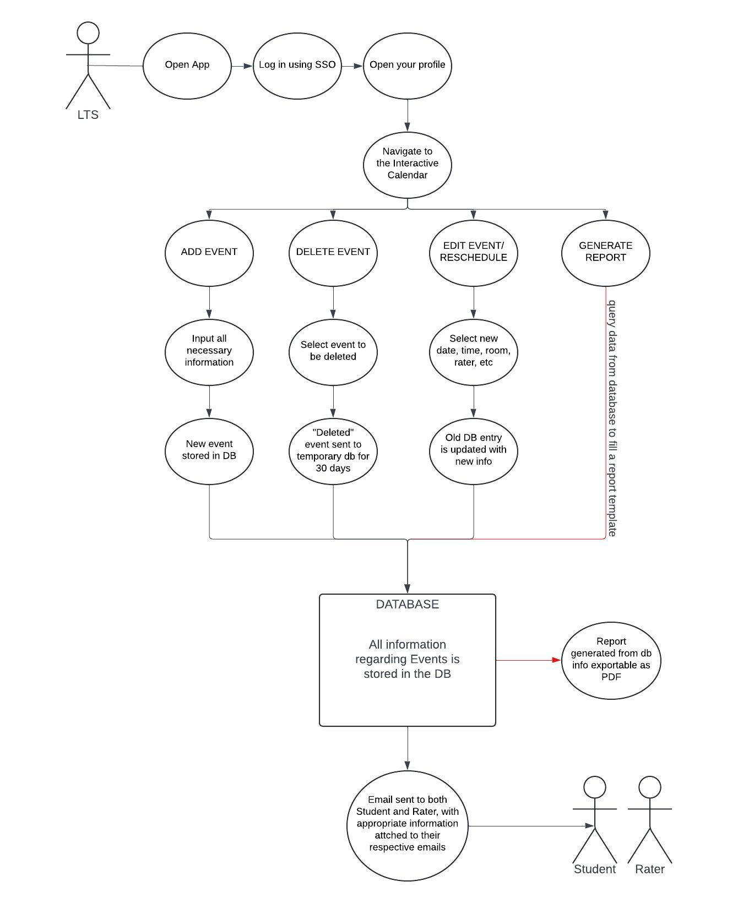
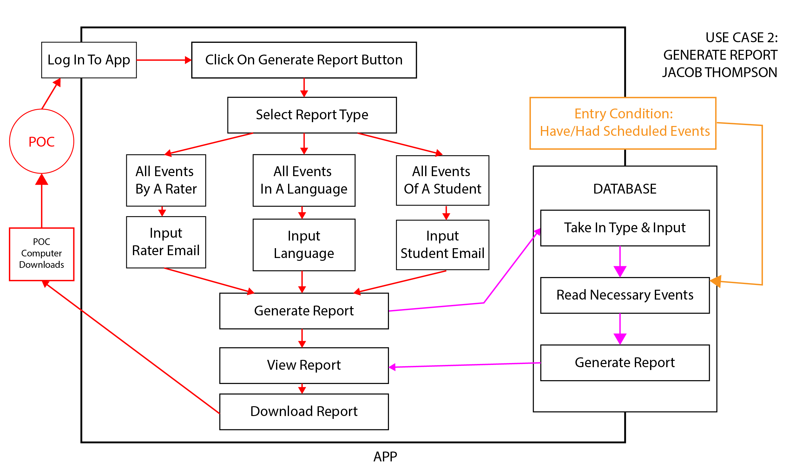
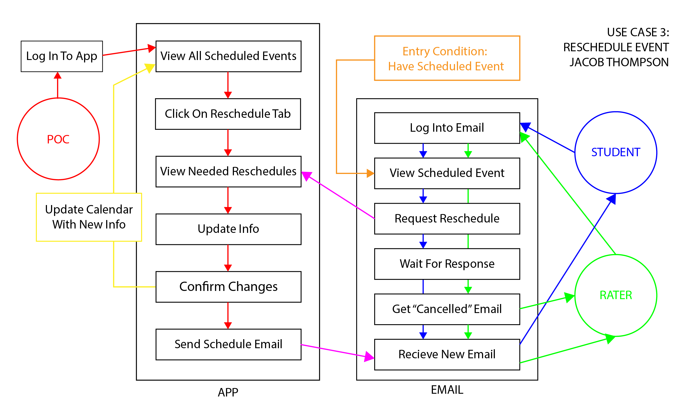
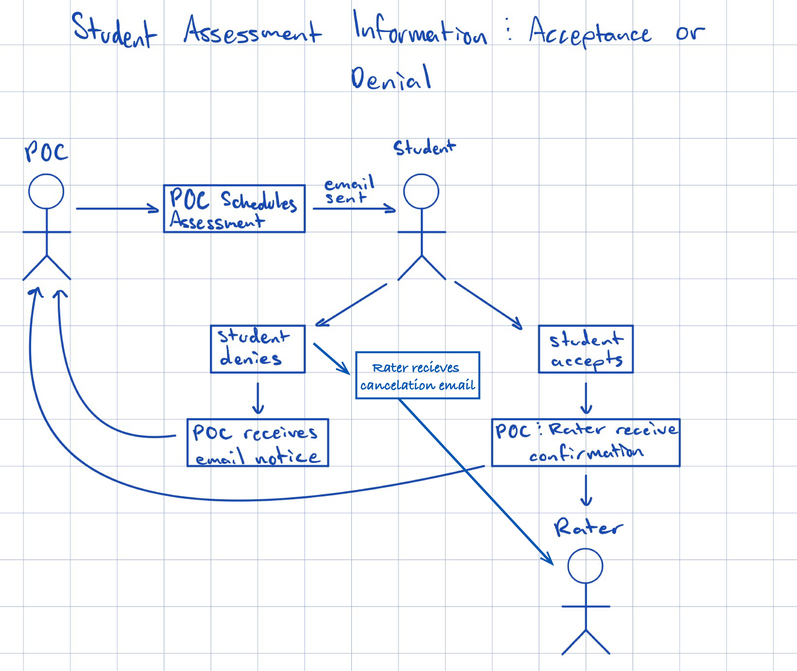
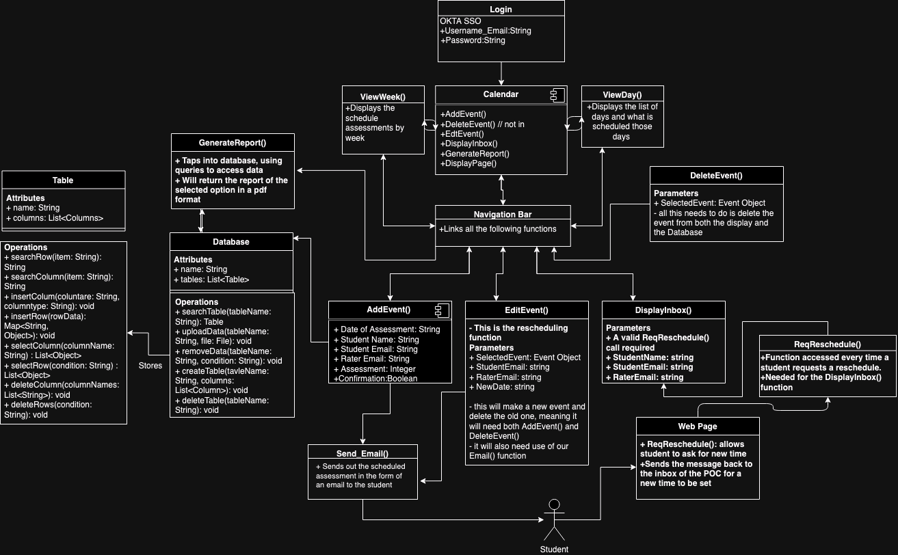

# Capstone CSE-306: Scheduling Progress Assessments

Welcome to the **Diplomacy Lab Progess Assessment Scheduling Calendar** project! This tool is designed to help streamline the scheduling of progress assessments for projects.

---

## Table of Contents

1. [About the Project](#about-the-project)
2. [Contributors](#contributors)
3. [Features](#features)
4. [Use Cases](#use-cases)
5. [Class Diagram](#class-diagram)

---

## About the Project

The Program Assessment Scheduling Calendar Application (PASC), developed for The Diplomacy Lab, is a management too for organizing and schedule progress assessments with research students. The main features of the application are to view, add, edit, delete, and reschedule progess assessments . These meetings will take place in person, and the needed information for scheduling an assessment is: Student Email, Rater Email(s), Date, Time, Room, Language, and E1-E3 (Which assessment they are on) Students are sent a confirmation email on adding/editing an event. In this email, if the time/date doesn't work for them, they can click a button which will take them to our student web panel. On this student web panel they can submit a reschedule request, which will tag an assessment and put in the the app's reschedule inbox. The app also generates reports on all of the assessments done by a specific rater, student, or language.

---

## Contributors

**Andrew Reed:** Front-end
**Anthony Rojas:** Back-end
**Jacob Thompson:** Team Lead, Front-end, UI/UX
**Raul Pena:** Database, Back-end
**Spencer Stafford:** Full-stack, Database

---

## Features

- Easy-to-use scheduling calendar interface
- Different calendar views (monthly, weekly, daily)
- Creating and Updating Assessments
- Generating Reports
- Student Rescheduling

---

## Use Cases

---

## Class Diagram

---

